# 面向高校毕业生的中国就业态势感知与职业决策支持平台

本项目是一个面向高校毕业生、就业指导老师和高校就业管理部门的就业数据分析与职业决策支持平台。系统围绕“真实招聘样本 -> 数据清洗建模 -> 可视化分析 -> 薪资参考 -> 职业建议 -> 管理员审计”形成完整闭环，适合作为毕业设计、就业数据分析系统和校园就业指导演示系统。

当前版本：`v5.0.0`。本版本继续保留登录页两组测试账号展示：普通用户 `用户 / 123456`，管理员 `admin / admin123`；同时把页面顶部时间和管理员审计时间统一为 `xxxx年xx月xx日 HH:mm:ss`，并补充全页面截图和更完整的项目说明。登录页只展示平台登录测试账号，不展示删除审计记录密码或解除封禁密码。

## 项目定位

平台解决的问题不是单纯展示岗位数量，而是把岗位规模、城市机会、薪资区间、技能需求、职业方向和数据质量放到同一个可解释系统里。普通用户可以查看全国就业态势、比较城市机会、估算薪资区间、观察技能趋势并生成职业建议；管理员账号可以进入平台状态页，查看登录 IP 审计、删除审计记录、处理临时封禁 IP。

系统前端使用 Vue3、TypeScript、ECharts 和 Element Plus；后端使用 Python FastAPI，不使用 Java。AI 职业推荐和薪资解释通过 OpenRouter 的 OpenAI-compatible Chat Completions 接入，未配置密钥、额度不足、限流或模型不可用时，后端会自动回退到本地规则结果。

## 数据来源

当前真实数据快照为 `data-processing/data/project_jobs_real.csv`，合并 Kaggle `China Jobs Data`、Kaggle `Job Posting Data in China` 和中国公共招聘网公开岗位列表，共 `37,772` 条岗位记录，其中 `37,380` 条有效薪资样本进入薪资分析和模型训练。

中国公共招聘网样本发布时间范围为 `2025-05-27` 至 `2026-05-19`。大陆 31 个省级区域均有真实岗位样本，香港有 Kaggle 样本；澳门、台湾暂无同口径岗位样本，系统显示“样本不足”，不使用虚构岗位数、薪资或热度补齐。数据真实性说明、官网地址、字段对应关系和校验方法见 [docs/data-source-verification.md](docs/data-source-verification.md)。

## 页面截图

### 1. 登录页

登录页展示系统定位、数据概览、身份说明和两组测试账号。普通用户进入分析平台，`admin` 账号进入平台状态与登录 IP 审计。

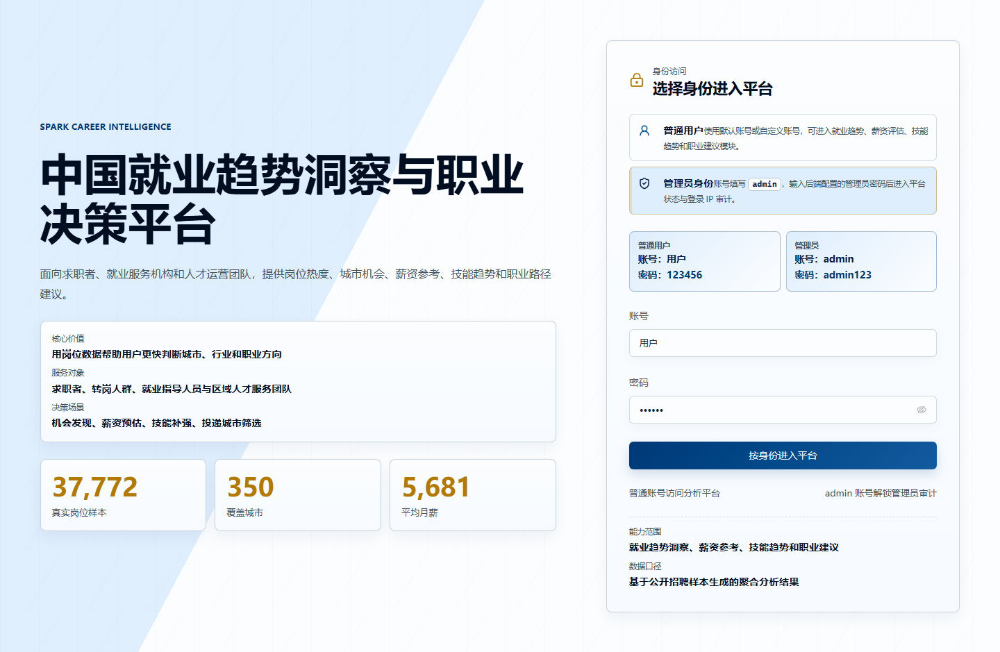

### 2. 就业市场首页

首页把岗位规模、城市覆盖、薪资样本和主要功能入口集中展示，适合作为老师和用户首次查看系统时的总览页。

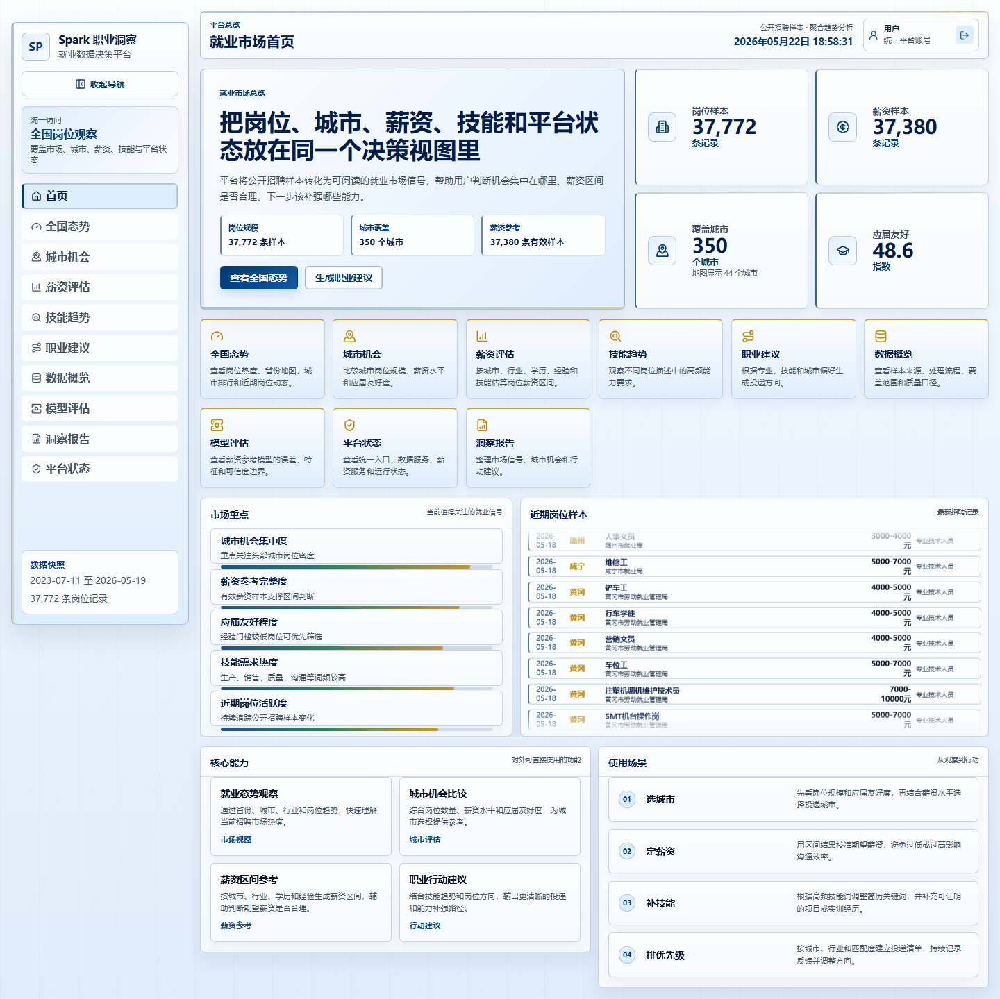

### 3. 全国就业态势

全国态势页展示核心指标、中国地图、省份热度、城市排行、薪资分布、行业结构、技能热度和实时岗位流。

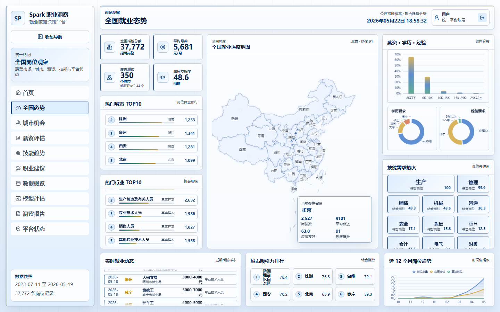

### 4. 城市机会

城市机会页用于比较不同城市的岗位规模、平均薪资、应届友好度和产业结构，辅助毕业生确定投递城市优先级。

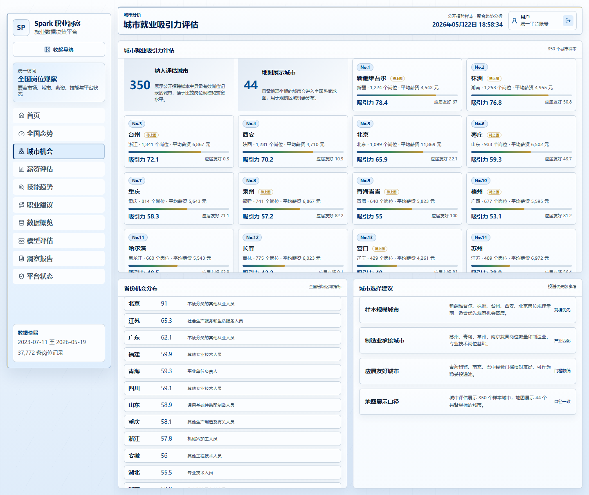

### 5. 薪资评估

薪资评估页根据城市、行业、学历、经验、企业规模、岗位类别和技能标签输出薪资参考区间，并在配置 AI 后生成解释。

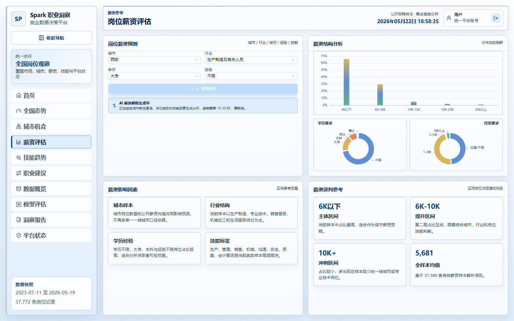

### 6. 技能趋势

技能趋势页基于岗位标题和岗位描述提取高频技能词，用于观察当前招聘市场中的能力需求和简历关键词方向。

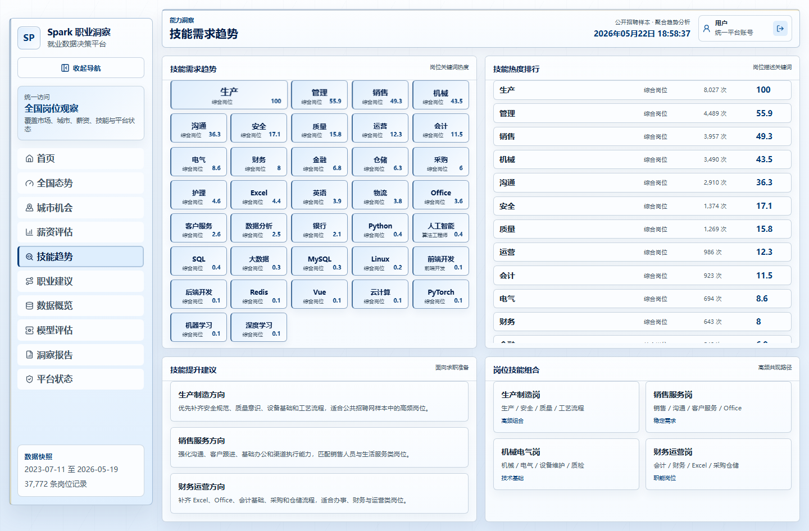

### 7. 职业建议

职业建议页结合专业、学历、技能、期望城市和行业偏好，输出岗位方向、目标城市和能力补强建议。

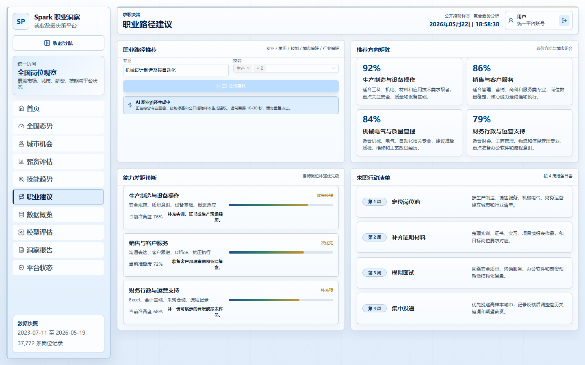

### 8. 数据概览

数据概览页说明样本来源、处理流程、覆盖范围、质量口径和数据透明度，便于毕业论文或答辩中解释数据可信度。

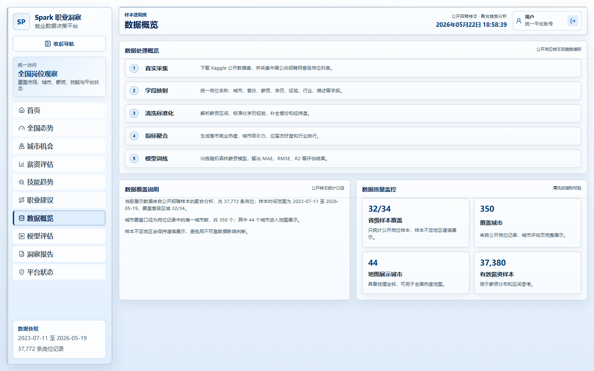

### 9. 模型评估

模型评估页展示薪资参考模型的误差、解释能力、样本口径和使用边界，避免把预测结果绝对化。

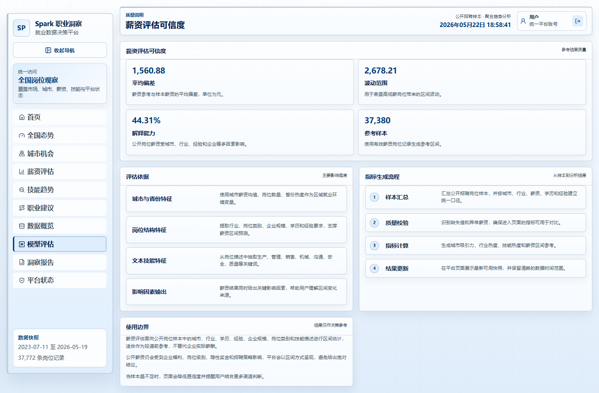

### 10. 洞察报告

洞察报告页把市场总览、城市机会、行业技能、薪资参考和行动建议整理为可阅读的结论。

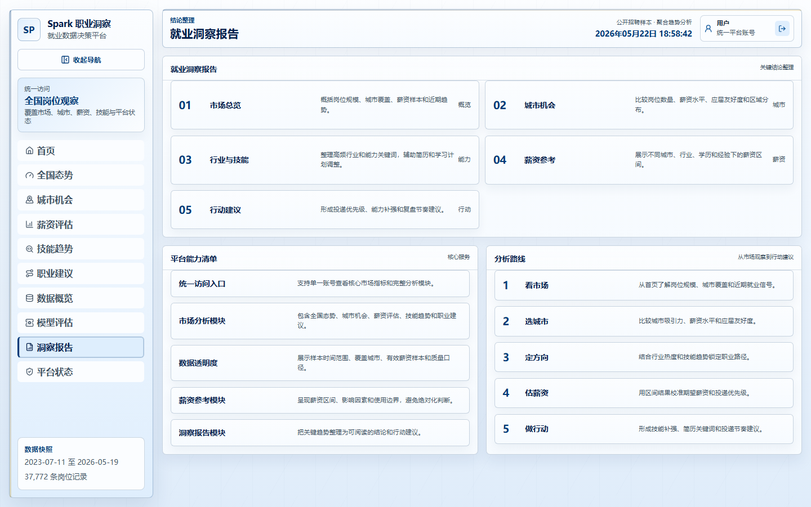

### 11. 平台状态

平台状态页为管理员视图，包含运行状态、登录 IP 审计、删除记录确认、删除密码防爆破、封禁 IP 列表和解除封禁操作。

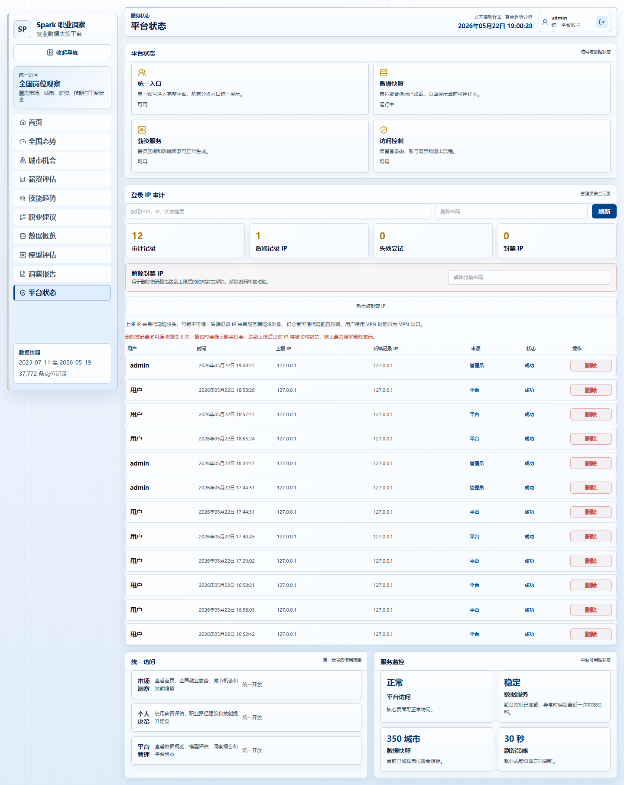

## 功能模块

- 登录入口：默认先进入登录页，页面展示普通用户 `用户 / 123456` 和管理员 `admin / admin123` 两组测试账号。
- 全国态势：展示岗位样本、薪资样本、城市覆盖、应届友好度、中国地图、城市排行和实时岗位流。
- 城市机会：按城市比较岗位规模、薪资水平、应届友好度和产业结构。
- 薪资评估：基于真实岗位样本训练的薪资参考模型，输出区间和影响因素。
- 技能趋势：使用中文分词、TF-IDF、TextRank 和技能词统计形成技能热度分析。
- 职业建议：按专业、学历、技能、城市和行业生成职业方向与行动建议。
- 数据概览：展示数据来源、处理流水线、覆盖范围和样本置信度。
- 模型评估：展示 MAE、RMSE、R2、特征影响和模型使用边界。
- 洞察报告：把关键趋势整理成面向就业指导的报告式结论。
- 管理员安全：支持登录 IP 审计、删除记录前确认、删除密码失败次数限制、临时封禁 IP、解除封禁 IP；删除密码和解除封禁密码仅以 PBKDF2 哈希形式保存在后端环境变量中。

## 技术架构

```text
用户浏览器
  -> Vue3 + TypeScript + ECharts 前端
    -> Vite 代理或 Nginx /api 反向代理
      -> Python FastAPI 后端
        -> 真实岗位快照聚合数据
        -> 薪资参考模型和本地规则推荐
        -> 可选 OpenRouter AI 推荐和薪资解释
        -> 管理员登录审计与封禁记录
```

```text
.
├─ backend/                 Python FastAPI 后端接口
├─ frontend/                Vue3 + TypeScript + ECharts 平台前端
├─ database/                MySQL 建表 SQL 与全国省市初始化样例数据
├─ data-processing/         Pandas / Scikit-learn / jieba 数据处理与模型脚本
├─ deploy/                  Nginx 容器配置
└─ docs/                    设计文档、部署说明、交付清单和页面截图
```

## 快速启动

### 1. 启动后端

```bash
cd backend
pip install -r requirements.txt
uvicorn app.main:app --reload --host 0.0.0.0 --port 8000
```

默认接口地址：`http://localhost:8000/api`

### 2. 启动前端

```bash
cd frontend
npm install
npm run dev
```

默认页面地址：`http://localhost:5173`

### 3. 登录测试账号

| 身份 | 账号 | 密码 | 说明 |
| --- | --- | --- | --- |
| 普通用户 | `用户` | `123456` | 进入首页、全国态势、城市机会、薪资评估、技能趋势、职业建议等分析页面 |
| 管理员 | `admin` | `admin123` | 进入平台状态页和登录 IP 审计页面 |

管理员删除审计记录和解除封禁需要在 `backend/.env` 中配置安全哈希，示例见 `backend/.env.example`。不要提交真实的 `ADMIN_SECURITY_PEPPER`、`ADMIN_DELETE_PASSWORD_HASH` 或 `ADMIN_UNBAN_PASSWORD_HASH`。

## AI 配置

职业推荐和薪资解释需要在 `backend/.env` 中配置 OpenRouter：

```env
AI_ENABLED=true
AI_API_KEY=你的 OpenRouter API Key
AI_BASE_URL=https://openrouter.ai/api/v1
AI_MODEL=openai/gpt-oss-120b:free
OPENROUTER_APP_NAME=EmploySight
```

未配置 `AI_API_KEY` 或 OpenRouter 调用失败时，系统继续使用本地规则推荐和本地薪资解释，不影响页面使用。

## Docker 部署

项目已提供 Docker 部署文件：

- `docker-compose.yml`：编排前端、后端、可选 MySQL、可选数据刷新容器。
- `backend/Dockerfile`：构建 FastAPI 后端镜像，版本标签为 `5.0.0`。
- `frontend/Dockerfile`：构建 Vue 前端并使用 Nginx 运行，版本标签为 `5.0.0`。
- `deploy/nginx/employsight.conf`：前端容器内 Nginx 配置，负责静态页面和 `/api` 反向代理。

```bash
docker compose up -d --build
```

Docker Compose 部署时，把 `AI_API_KEY`、`ADMIN_SECURITY_PEPPER`、`ADMIN_DELETE_PASSWORD_HASH` 和 `ADMIN_UNBAN_PASSWORD_HASH` 放到项目根目录 `.env`，不要把真实密钥或真实哈希提交到 Git。完整部署流程见 [docs/docker-deployment.md](docs/docker-deployment.md)。

## 数据处理

```bash
cd data-processing
pip install -r requirements.txt
python prepare_kaggle_data.py
python collect_mohrss_jobs.py --pages-per-province 80 --workers 8
python build_project_dataset.py
python pipeline.py --input data/project_jobs_real.csv --output output
python export_dashboard_data.py
```

数据处理会生成前端和后端使用的聚合快照，包含省市热度、城市评估、薪资分布、技能热度、行业排行和模型评估结果。

## 验证命令

```bash
cd frontend
npm run build
```

```bash
python -m pytest backend\tests
python -m compileall backend data-processing
python data-processing\pipeline.py --input data-processing\sample_jobs.csv --output data-processing\output
```

## 相关文档

- [docs/project-design.md](docs/project-design.md)：毕业设计方案和系统设计。
- [docs/delivery-checklist.md](docs/delivery-checklist.md)：交付物、功能证据和验证清单。
- [docs/data-source-verification.md](docs/data-source-verification.md)：真实数据来源、字段映射和校验方法。
- [docs/server-migration-and-data-integration.md](docs/server-migration-and-data-integration.md)：服务器迁移和真实数据接入流程。
- [docs/docker-deployment.md](docs/docker-deployment.md)：Docker 容器化部署说明。
